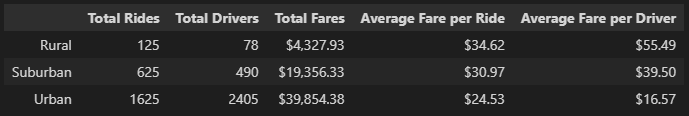

# PyBer Analysis

1. Overview of the analysis
    - This would be a written report on my findings about ride data within differnt city types. This would be giving some of my initial thoughts and analysis on the tables and multi-line graph created throughout the code.

2. Results
    - Urban Cities had the vast majority of rides, drivers, and amount of money earned overall but do not perform the best per driver.
    - Rural Cities have the highest fare cost per ride and also give the most money back to the drivers.
    - Suburban cities would be sitting at the average point for all 3 city types.

3. Suggestions for improvement
    - For urban cities cut back on the number of drivers. Perhaps having them working more in rural or suburban areas.
    - More advertisement to increase the number of rides happening.
    - Charge more per ride in urban areas since the need is greater.